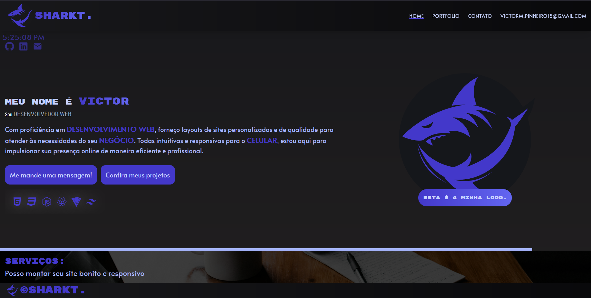

# Este é o meu portfólio online.

Estou feliz em compartilhar que concluí com sucesso um projeto que finalmente esta pronto. Foi dificil, porem ao longo do desenvolvimento fui dominando ferramentas como Tailwind e Framer Motion. Embora ainda esteja aprendendo seus recursos, porem tentei extrair o máximo de cada uma delas.

Muitas vezes, precisei interromper meu fluxo de trabalho para resolver bugs desconhecidos, recorrendo a documentações e tutoriais online para superá-los, e vou dizer deu uma dor de cabeça. Mas foram fundamentais e no fim divertido.

Após dedicar aproximadamente uma semana e meia a esse projeto, alcancei o resultado desejado. Embora reconheça que o código possa parecer um tanto desorganizado, reflete os obstáculos que superei para alcançar a funcionalidade esperada. Estou ansioso para compartilhar meu trabalho e continuar aprimorando minhas habilidades enquanto avanço em minha carreira no desenvolvimento web.

